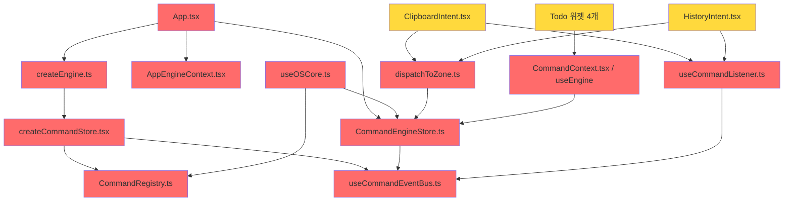

# OS-New 레거시 코드 감사 보고서

> 2026-02-12 00:20 — Phase 1~2 제거 후 남은 레거시 현황

---

## 요약

| 구분 | 파일 수 | LOC | 비율 |
|---|---|---|---|
| **전체 os-new/** | 121 | 9,685 | 100% |
| 🔴 **Legacy (제거 대상)** | 17 | ~1,352 | **14%** |
| 🟡 **Bridge (전환 대기)** | 6 | ~350 | 3.6% |
| ⚫ **Dead Code (즉시 삭제 가능)** | 3 | ~70 | 0.7% |

---

## 🔴 Legacy Command Pipeline (Phase 3 대상)

전부 `core/command/` 폴더 안. **Todo 앱 마이그레이션 시 일괄 삭제 예정.**

| 파일 | LOC | 외부 소비자 | 역할 |
|---|---|---|---|
| `createCommandStore.tsx` | 136 | `createEngine.ts` | Zustand 기반 커맨드 스토어 |
| `CommandEngineStore.ts` | 160 | `App.tsx`, `useOSCore.ts`, inspector 2개 | 앱 등록/디스패치 글로벌 스토어 |
| `CommandRegistry.ts` | 119 | `createCommandStore`, `createEngine` | 커맨드 룩업 테이블 |
| `useCommandEventBus.ts` | 58 | `ClipboardSensor`, `FocusSensor`, `createCommandStore` | 커맨드 이벤트 브로드캐스트 |
| `useCommandListener.ts` | 64 | `ClipboardIntent`, `HistoryIntent` | 커맨드 구독 훅 |
| `AppEngineContext.tsx` | 31 | `App.tsx` | 앱 엔진 React Context |
| `CommandContext.tsx` (useEngine) | 72 | Todo 위젯 4개 | 앱 상태/디스패치 훅 |
| `createEngine.ts` | 35 | `App.tsx` | 엔진 팩토리 (이미 빈 껍데기) |
| `createCommandFactory.ts` | 46 | (internal) | 커맨드 정의 헬퍼 |
| `CommandTelemetryStore.ts` | 77 | (internal) | 텔레메트리 Zustand 스토어 |
| `dispatchToZone.ts` | 34 | `ClipboardIntent`, `HistoryIntent` | Zone별 커맨드 라우터 |

**소계: 832 LOC**

---

## 🔴 Legacy 지원 파일

| 파일 | LOC | 역할 | 비고 |
|---|---|---|---|
| `defineApplication.ts` | 29 | 앱 정의 타입 | Kernel `appSlice`로 대체됨 |
| `useOSCore.ts` | 29 | OS 초기화 훅 | `CommandEngineStore` 의존 |
| `FieldRegistry.ts` | 133 | Field 편집 레지스트리 | Zustand. Kernel 전환 필요 |
| `osCommand.ts` (pipeline/core) | 60 | OS 커맨드 파이프라인 유틸 | `createCommandStore` 의존 |

**소계: 251 LOC**

---

## ⚫ Dead Code (외부 참조 0건 — 즉시 삭제 가능)

| 파일 | LOC | 근거 |
|---|---|---|
| `schema/legacy-index.ts` | 6 | 아무데서도 import 안 함 |
| `core/application/appEffects.stub.ts` | 32 | 아무데서도 import 안 함. Gap 3 스텁 |
| `6-components/Zone.kernel.tsx` | 30 | 아무데서도 import 안 함. Zone 리팩토링 실험 파일 |

**소계: ~68 LOC**

---

## 🟡 Bridge 컴포넌트 (Legacy에 의존하지만 Kernel-native로 전환 필요)

Legacy Pipeline을 직접 소비하는 외부 파일들. Phase 3 삭제 시 함께 업데이트해야 함.

| 파일 | 의존 대상 | 전환 방향 |
|---|---|---|
| `6-components/App.tsx` | `createEngine`, `CommandEngineStore`, `AppEngineContext` | Kernel `appSlice` 기반으로 재작성 |
| `6-components/Trigger.tsx` | `CommandEngineStore` | Kernel dispatch 직접 사용 |
| `1-listeners/clipboard/ClipboardIntent.tsx` | `useCommandListener`, `dispatchToZone` | Kernel middleware로 전환 |
| `1-listeners/clipboard/ClipboardSensor.tsx` | `useCommandEventBus` | Zone props로 전환 |
| `1-listeners/history/HistoryIntent.tsx` | `useCommandListener`, `dispatchToZone` | Kernel middleware로 전환 |
| `1-listeners/focus/FocusSensor.tsx` | `useCommandEventBus` | Kernel 이벤트로 전환 |

---

## 🟢 Kernel-Native (건드리지 않아도 됨)

나머지 **95파일**은 이미 Kernel Pipeline 기반으로 동작 중:
- `kernel.ts`, `3-commands/*`, `2-contexts/*`, `5-hooks/*`
- `6-components/Zone.tsx`, `Item.tsx`, `Modal.tsx`, `Dialog.tsx` 등
- `schema/*`, `lib/*`, `primitives/*`, `middleware/historyKernelMiddleware.ts`

---

## 의존 그래프 (삭제 순서)

**🔴 = 삭제 대상, 🟡 = 전환 필요**

---

## 제거 전략

1. **즉시**: Dead Code 3건 삭제 (68 LOC, 위험도 0)
2. **Todo 마이그레이션과 동시**: Phase 3 전체 (1,352 LOC)
   - `App.tsx` → Kernel `appSlice` 기반 재작성
   - Todo 위젯 4개 → `useEngine` → Kernel hooks
   - Intent/Sensor 6개 → Kernel middleware/events
   - `core/command/` 폴더 전체 삭제
3. **최종**: `FieldRegistry.ts` → Kernel state로 흡수 (Field 전환 시)
