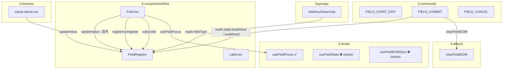

# Field 설계 개선 리뷰

> `/review` 보고서 모드 | 2026-02-19 18:00 | 수렴 1회차

## 검사 범위

| 파일 | 역할 |
|------|------|
| [Field.tsx](file:///Users/user/Desktop/interactive-os/src/os/6-components/field/Field.tsx) | UI 프리미티브 (contentEditable) |
| [FieldRegistry.ts](file:///Users/user/Desktop/interactive-os/src/os/6-components/field/FieldRegistry.ts) | Vanilla store — Field 상태 관리 |
| [field.ts](file:///Users/user/Desktop/interactive-os/src/os/3-commands/field/field.ts) | FIELD_START_EDIT / COMMIT / CANCEL 커맨드 |
| [InputListener.tsx](file:///Users/user/Desktop/interactive-os/src/os/1-listeners/input/InputListener.tsx) | 글로벌 DOM input → FieldRegistry 동기화 |
| [useFieldHooks.ts](file:///Users/user/Desktop/interactive-os/src/os/5-hooks/useFieldHooks.ts) | Field DOM sync / focus hooks |
| [fieldKeyOwnership.ts](file:///Users/user/Desktop/interactive-os/src/os/keymaps/fieldKeyOwnership.ts) | FieldType별 키 위임 테이블 |
| [defineApp.bind.ts](file:///Users/user/Desktop/interactive-os/src/os/defineApp.bind.ts) | Zone → Field 바인딩 팩토리 |
| [field-registry.test.ts](file:///Users/user/Desktop/interactive-os/src/os/6-components/tests/integration/field-registry.test.ts) | Integration 테스트 |
| [todo/app.ts](file:///Users/user/Desktop/interactive-os/src/apps/todo/app.ts) | Field 소비자 (벤치마크 앱) |

---

## 설계 의도 요약

이전 대화 (`6b9d8649`, `b2c663cd`)에서 논의한 핵심 아이디어:

1. **데이터 스트림 ↔ 커맨드 스트림 분리** — 매 키 입력을 커맨드로 보내던 `syncDraft` 패턴 제거
2. **FieldRegistry** — OS가 관리하는 vanilla store. 필드의 로컬 값, 에러, dirty 상태를 추적
3. **onCommit + trigger** — 앱은 "언제 커밋할지(trigger)"와 "커밋 시 무엇을 할지(onCommit)"만 선언
4. **FieldType + Key Ownership** — 필드 타입별로 어떤 키를 OS에게 위임하는지 정적 테이블화

---

## 발견 사항

### 🔴 1. `state.localValue` vs `state.value` — 이름 분열 (기능 파손)

**심각도: `[Blocker]`** — 7개 테스트 실패, 런타임 데이터 유실 가능

```
Tests: 7 failed | 17 passed (24)
```

`FieldRegistry.ts`의 `FieldState` 인터페이스는 `value`를 사용하지만, 다음 3곳에서 `localValue`를 참조:

| 위치 | 참조 | 실제 필드명 |
|------|------|------------|
| [field.ts:88](file:///Users/user/Desktop/interactive-os/src/os/3-commands/field/field.ts#L88) | `fieldEntry.state.localValue` | `value` |
| [InputListener.tsx:4](file:///Users/user/Desktop/interactive-os/src/os/1-listeners/input/InputListener.tsx#L4) | 주석에 `localValue` 언급 | — |
| [field-registry.test.ts](file:///Users/user/Desktop/interactive-os/src/os/6-components/tests/integration/field-registry.test.ts) | 전체에서 `state.localValue` 사용 | `value` |

**원인**: `FieldRegistry` 리팩토링 시 `localValue` → `value`로 이름을 변경했으나, 소비자 코드가 갱신되지 않음.

**영향**: `FIELD_COMMIT`이 `state.localValue`를 읽으면 `undefined` → `onSubmit({ text: undefined })` → 입력이 증발. Todo 앱에서 Enter로 추가 시 빈 텍스트가 전달될 수 있음.

> **원칙 위반**: "이름은 법이다" (Rule #6). grep 한 번이면 모든 연결이 보여야 한다.

---

### 🔴 2. 입력 이벤트 이중 처리 — InputListener × Field.tsx

**심각도: `[Blocker]`** — 커맨드가 2회 디스패치될 수 있음

`InputListener.tsx` (Line 30)와 `Field.tsx` (Line 318-326) **둘 다** DOM `input` 이벤트에서 `FieldRegistry.updateValue()`를 호출:

```diff
// InputListener.tsx:30 — 글로벌 캡처
  FieldRegistry.updateValue(fieldId, text);

// Field.tsx:320 — 로컬 리스너
  FieldRegistry.updateValue(fieldId, text);
```

`trigger === "change"`일 때 `Field.tsx`의 `handleInput`은 `handleCommit(text)`까지 호출하고, `InputListener`도 `onChange` 커맨드를 디스패치. 사실상 하나만 있어야 할 경로가 둘.

> **원칙 위반**: "모든 변경은 하나의 문을 통과한다" (Rule #3). 상태 변경의 경로가 둘이면, 버그의 경로도 둘.

**판단**: `InputListener`가 글로벌 레벨에서 contentEditable → FieldRegistry 동기화를 담당하는 것이 원래 설계 의도. `Field.tsx`의 로컬 `handleInput`은 이 역할을 중복하고 있음. 둘 중 하나만 남겨야 함.

---

### 🟡 3. `FieldConfig`에 `defaultValue` 미선언 — 타입 구멍

**심각도: `[Suggest]`**

`FieldRegistry.register()`에서 `config.defaultValue`를 참조 (Line 89):
```ts
value: config.defaultValue || "",
```

그러나 `FieldConfig` 인터페이스에 `defaultValue`는 선언되어 있지 않음 → TypeScript가 잡지 못하는 `as any` 없는 타입 누수.
단위 테스트도 `{ name: id, defaultValue: "Default" }`를 전달하지만 타입 에러 없이 통과 (객체 리터럴 잉여 속성 검사가 제네릭 경로에서 빠질 수 있음).

> **원칙 위반**: "100% 타입" (Goal #4). 타입은 가드레일.

---

### 🟡 4. `useFieldState` / `useFieldDOMSync` — 사용하지 않는 훅

**심각도: `[Suggest]`**

`useFieldHooks.ts`의 `useFieldState` (useState 기반)와 `useFieldDOMSync`는 **FieldRegistry 도입 이전** 설계의 잔재. 현재 `Field.tsx`는 FieldRegistry에서 값을 구독하고, DOM 동기화를 자체 `useLayoutEffect`로 처리.

실제 사용 현황:
- `useFieldState` → `Field.tsx`에서 **미사용** (FieldRegistry가 대체)
- `useFieldDOMSync` → `Field.tsx`에서 **미사용** (자체 `useLayoutEffect`가 대체)
- `useFieldFocus` → `Field.tsx`에서 사용 중 ✅
- `useFieldContext` → `Field.tsx`에서 **미사용**

> **원칙 위반**: "모든 산출물은 부채다" (Rule #5). 존재하는 것은 정당화되어야 한다.

---

### 🔵 5. Field.tsx 내 사고 과정 주석 잔존

**심각도: `[Nitpick]`**

Line 301-312에 개발 중 사고 과정이 주석으로 남아 있음:
```ts
// It seems `useFieldFocus` or `InputSensor` (not shown) handles it?
// Actually, `Field` in the previous code relied on `InputSensor`...
// If `InputSensor` is handling events, we need to know how...
// BUT, I can attach event listeners to `innerRef.current` manually...
```

이는 에이전트의 추론 과정이지 코드 문서가 아님. 삭제 대상.

---

### 🔵 6. `triggerRaw` prop → 타입 미선언

**심각도: `[Nitpick]`**

`Field.tsx` Line 120에서 destructure하는 `triggerRaw`는 `FieldProps`에 선언되어 있지 않음. 현재 사용되지도 않고, Line 139에서 `(rest as any).trigger`로 우회.

---

## 현재 상태 판단

```
🔴 Blocker  2건
🟡 Suggest  2건
🔵 Nitpick  2건
```

### 설계 의도 대비 진행 상황

| 의도 | 상태 | 비고 |
|------|------|------|
| FieldRegistry vanilla store | ✅ 구현 완료 | subscribe/snapshot 패턴 |
| onCommit + trigger 선언형 | ✅ 작동 | todo `TodoDraftUI`에서 사용 중 |
| FieldType key ownership | ✅ 작동 | 4종 preset, delegation table |
| syncDraft 제거 | ⚠️ 불완전 | InputListener가 onChange 디스패치 잔존 |
| 데이터/커맨드 스트림 분리 | ⚠️ 불완전 | 입력 경로가 2개 (Finding #2) |
| 타입 안전성 | ❌ 구멍 | `defaultValue` 미선언, `localValue` 런타임 undefined |
| 테스트 통과 | ❌ 7 fail | `localValue` vs `value` 네이밍 불일치 |

### 아키텍처 지도 (현재)



## 🔴 수정 여부

2건의 Blocker가 있습니다. 즉시 수정하시겠습니까?

1. **`state.localValue` → `state.value` 통일** (또는 반대 방향: `FieldState`에 `localValue`를 공식 추가)
2. **입력 경로 단일화** — `InputListener` vs `Field.tsx` 로컬 리스너 중 하나 선택
