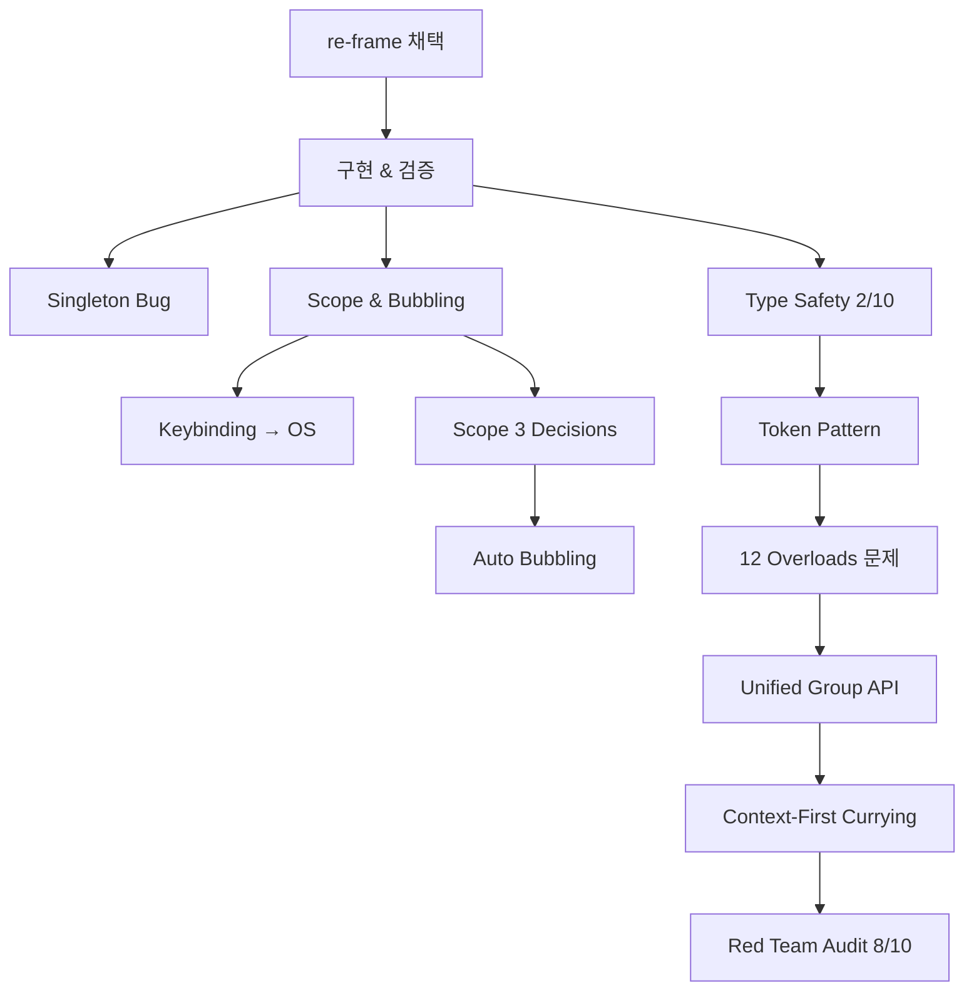

# Kernel 아키텍처 의사결정 여정

> 27개 ADR을 시간순으로 압축한 디스커션 저니
> 원본: `docs/4-archive/2026/kernel-adr/` (아카이브 이동)
> 기간: 2026-02-09 ~ 2026-02-10

---

## Phase 1: 출발점 — re-frame 코어 엔진

### 왜 re-frame인가? (ADR-019, 02-architecture)

**문제**: SPA 프레임워크의 상태 관리가 컴포넌트에 분산되어 AI가 코드를 이해하기 어렵다. "LLM이 읽고 쓰는 시대에 사람이 아니라 기계가 이해하기 쉬운 구조가 생산성이다."

**결정**: Clojure의 re-frame 아키텍처를 TypeScript로 포팅.
- 단일 atom(store) + 순수 핸들러 + side-effect 분리
- Six Dominoes: dispatch → handler → effect → subscription → view → DOM

### Naming & Glossary (ADR-020, 023)

re-frame 용어 → FE 친화 용어로 번역:
- `reg-event-fx` → `defineCommand`
- `reg-fx` → `defineEffect`
- `reg-sub` → `defineComputed`
- `reg-cofx` → `defineContext` + `inject`
- `interceptor` → `Middleware { id, before, after }`

### Usage Guide & 3-Layer Architecture (ADR-021, 022)

```
Kernel  — 범용 이벤트 엔진 (dispatch, handler, effect, middleware)
OS      — 입력 해석 + 포커스 + ARIA (keybinding, sensor, zone)
App     — 비즈니스 로직 (Todo, Kanban, Mail)
```

**핵심 규칙**: Kernel은 "포커스", "키보드", "DOM"을 모른다. Command만 안다.

---

## Phase 2: 구현 & 첫 검증

### Implementation (ADR-001)

716 LOC, 0 dependencies. 자체 스토어(`createStore`) 구현.
- dispatch → handler → effect → middleware 파이프라인 완성
- 44개 테스트 전부 통과
- Six Dominoes 달성도: 핵심 엔진 80% (subscription 미구현)

### Singleton Bug (ADR-002)

`useSyncExternalStore`가 **특정 스토어 인스턴스**의 subscribe에 바인딩됨.
`initKernel()`이 두 번 호출되면 Store A/B 분리 → React 구독 단절.

**해결**: `initKernel()`을 싱글톤으로 — 기존 스토어가 있으면 상태만 리셋.

**교훈**: 외부 스토어는 싱글톤이어야 한다.

---

## Phase 3: Scope & Bubbling — 계층적 dispatch

### 문제 (ADR-003)

re-frame은 flat dispatch. 하지만 OS는 멀티 앱 + 중첩 Zone.
"같은 Enter, 다른 동작" → scope 계층에 따라 핸들러가 달라야 한다.

**기존**: 이중 경로 (passthrough 커맨드 vs OS 커맨드) + Zone prop 폭발

**제안**: DOM 이벤트 버블링 모델을 Kernel에 도입.
```
dispatch(ACTIVATE)
  → bubblePath: [card-list, col-1, kanban-board, __global__]
  → 가장 가까운 scope의 핸들러 실행
```

### Keybinding 위치 논쟁 (ADR-004)

Red Team: "Kernel의 라우팅 규칙이다."
Blue Team: "센서의 입력 번역이다. Kernel은 키보드를 모른다."

**결정**: defineKeybinding은 **OS 레이어**. Kernel은 Command만 받고, 그것이 키보드에서 왔는지 마우스에서 왔는지 모른다.

### Scope 설계 결정 3가지 (ADR-005, 006)

| 결정 | 선택 | 근거 |
|------|------|------|
| Scope 전달 | **Explicit** (bubblePath 배열) | 결정론적 dispatch, time travel |
| Scope Tree | **OS 관리** (Kernel은 배열만 순회) | Kernel 최소화 |
| Middleware | **Scope-level** (handler와 동일 모델) | 일관성 |

### Auto Bubbling (Scope Tree in Kernel)

이후 Kernel 내부에 scope tree를 둬서 `buildBubblePath()`를 Kernel이 자동 계산하는 제안도 등장 (2026-02-10). OS가 매번 경로를 만들 필요 없이, `defineScope(id, { parent })` 후 Kernel이 자동 순회.

---

## Phase 4: Type Safety — 100% Strict

### 전수 조사 (ADR-007)

9개 지점에서 raw string, 10개 지점에서 `unknown`, 2개 index signature.
타입 안전성 **2/10**.

**절대 원칙**: "LLM 시대에 암묵적인 것은 절대 없어야 한다."

### Token 패턴 (ADR-007, 008)

```
defineCommand → CommandToken (branded, phantom type)
defineEffect  → EffectToken
defineContext → ContextToken
defineScope   → ScopeToken

dispatch(TOKEN())  ← ✅
dispatch({ type: "typo" })  ← ❌ 컴파일 에러
```

- CommandFactory: `TOKEN(payload)` 호출 → Command 객체 반환 → dispatch는 Command만 받음
- EffectMap: index signature 제거, Token computed key만 허용
- Context: inject에서 ContextToken 타입이 ctx에 자동 전파

**타입 안전성: 2/10 → 10/10 목표**

---

## Phase 5: API 진화 — Unified Group

### defineCommand 오버로드 문제 (ADR-010)

scope × payload × inject × middleware 조합 → **12개 오버로드**. TS 추론 실패, LLM 환각.

8개 대안(Config, Builder, ctx.get, 커링 등)을 비교 후:

**핵심 트레이드오프 발견**: declarative coeffect 선언(re-frame 순수성)과 TypeScript 추론은 양립 불가.

### Group API (ADR-011, 012)

**해결**: `kernel.group()` — scope + inject + effect를 묶는 단일 인터페이스.

```typescript
const { defineCommand } = kernel.group({
  scope: CARD_LIST,
  inject: [NOW, AUTH],
});

defineCommand("USE_TIME", (ctx) => {
  ctx.NOW;   // number — 자동 추론
  ctx.AUTH;  // AuthInfo — 자동 추론
});
```

### Context-First Currying (ADR-012)

v2.1 업그레이드. Payload 핸들러의 ctx 타입 추론 실패(L1)를 완벽 해결.
**변경 규모**: 39 files, +4546 / -920 LOC.

### Red Team Context-First 분석 (ADR-013)

Context-First Curried Pattern의 약점 분석 → 수용 가능 판정.

---

## Phase 6: 구조 & 문서 정비

### File Structure (ADR-014, 015, 016)

**원칙**: "파일명 = 공개 API". `kernel.defineCommand(...)` → `defineCommand.ts`.
`core/`는 내부 구현, 외부 직접 import 금지.

### Red Team Audit (ADR-009)

**결과**: CRITICAL 1건 + HIGH 4건 → Group API 적용으로 C1, H1, H2, H4 해결.
**타입 안전성: 2/10 → 6/10 → 8/10**.
남은 이슈: Store<unknown> 싱글턴 타입 소멸 (H3).

### Full Interface Spec & Documentation Plan (ADR-024, 018)

Kernel Layer의 전체 API를 `Command`, `Handler`, `EffectMap`, `Context`, `Scope`, `Middleware`, `Store`, `Transaction` 구조로 명세화. PARA 문서 구조 초안 작성.

### TestBot 분석 (ADR-017)

KernelLab TestBot의 expect 미동작: `findByText` 완전 일치 vs Playwright 부분 일치 차이.

---

## 결론: 의사결정 체인



**한줄요약**: re-frame의 flat dispatch를 계층적 scope+bubbling으로 확장하고, Token 기반 100% type-strict API로 진화시킨 여정.
