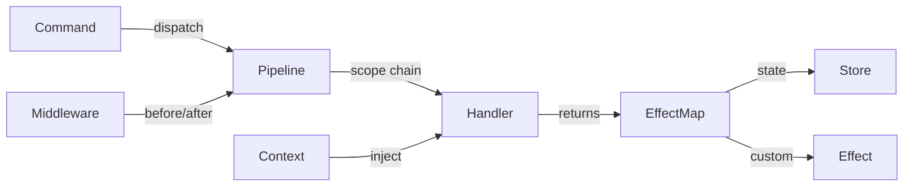

# Core Concepts

> The six building blocks of every kernel application.

---

## Overview

Kernel has six core concepts. Everything else is built from these primitives.



| Concept | Role | Created by |
|---|---|---|
| **Command** | Data describing intent | `defineCommand()` → `CommandFactory()` |
| **Effect** | Side-effect handler | `defineEffect()` |
| **Context** | Read-only data injection | `defineContext()` + `group({ inject })` |
| **Scope** | Namespace for command resolution | `defineScope()` + `group({ scope })` |
| **Middleware** | Cross-cutting before/after hooks | `group.use()` |
| **State** | Single immutable state tree | `createKernel(initialState)` |

---

## Command

A Command is an immutable data object describing **what should happen**. Commands are created by `CommandFactory` functions returned from `defineCommand()`.

### Defining Commands

```typescript
// No payload
const INCREMENT = kernel.defineCommand(
  "INCREMENT",
  (ctx) => () => ({
    state: { ...ctx.state, count: ctx.state.count + 1 },
  }),
);

// With payload
const SET_COUNT = kernel.defineCommand(
  "SET_COUNT",
  (ctx) => (value: number) => ({
    state: { ...ctx.state, count: value },
  }),
);
```

### Handler Signature

The handler uses a **context-first curried** pattern:

```typescript
(ctx: { state: S, ...injected }) => (payload: P) => EffectMap | undefined
```

- `ctx.state` — current state (read-only)
- `ctx.{injected}` — values from `group({ inject })` 
- Returns `EffectMap` — state + effects to execute
- Returns `undefined` — skip this scope, bubble to parent

### Dispatching

```typescript
kernel.dispatch(INCREMENT());       // void payload
kernel.dispatch(SET_COUNT(42));     // number payload

SET_COUNT("wrong");                 // ❌ Compile error
```

> [!IMPORTANT]
> There is no `dispatch("INCREMENT")` or `dispatch("SET_COUNT", 42)`.
> The CommandFactory creates the Command; dispatch receives it. **Single signature, no overloads.**

### Bubbling

When a handler returns `undefined` (or `null`), the command **bubbles** to the parent scope:

```typescript
const ACTION = scopedGroup.defineCommand(
  "ACTION",
  (ctx) => () => {
    if (!ctx.state.isReady) return undefined; // bubble up
    return { state: nextState };              // handled — stop
  },
);
```

---

## Effect

Effects are **side-effect handlers**. Handlers don't execute side effects directly — they declare them in the return value, and the engine executes them.

### Defining Effects

```typescript
const FOCUS_ID = kernel.defineEffect("FOCUS_ID", (id: string) => {
  document.getElementById(id)?.focus();
});

const SCROLL_TO = kernel.defineEffect("SCROLL_TO", (id: string) => {
  document.getElementById(id)?.scrollIntoView({ block: "nearest" });
});
```

### Using Effects in Handlers

Use the `EffectToken` as a **computed key** in the return object:

```typescript
const NAVIGATE = kernel.defineCommand(
  "NAVIGATE",
  (ctx) => (direction: "up" | "down") => {
    const targetId = resolveTarget(ctx.state, direction);
    return {
      state: { ...ctx.state, focusedId: targetId },
      [FOCUS_ID]: targetId,     // ✅ string — type checked
      [SCROLL_TO]: targetId,    // ✅ string — type checked
    };
  },
);
```

### Built-in Effect Keys

| Key | Behavior |
|---|---|
| `state` | Replaces the state tree (always executed first) |
| `dispatch` | Re-dispatches commands (single or array, queued) |

```typescript
return {
  state: nextState,
  dispatch: [CMD_A(), CMD_B()],  // queued after current command
};
```

### Effect Scoping

Effects defined in a scoped group can **override** global effects. Resolution follows the scope chain:

```typescript
// GLOBAL: default toast
kernel.defineEffect("TOAST", (msg: string) => systemToast(msg));

// Widget scope: override
const widgetGroup = kernel.group({ scope: WIDGET });
widgetGroup.defineEffect("TOAST", (msg: string) => miniPopup(msg));
// → Widget commands use miniPopup; other commands use systemToast
```

> [!NOTE]
> Each effect handler is wrapped in try-catch. One failing effect does not block others.

---

## Context

Context provides **read-only external data** to command handlers — similar to re-frame's coeffects.

### Defining Context

```typescript
const NOW = kernel.defineContext("NOW", () => Date.now());
const USER = kernel.defineContext("USER", () => ({
  name: "Alice",
  role: "admin",
}));
```

The provider function is **called at dispatch time** — no caching, always fresh.

### Injecting into Groups

Declare which contexts a group needs via `inject`:

```typescript
const group = kernel.group({
  scope: MY_SCOPE,
  inject: [NOW, USER],
});

const CMD = group.defineCommand("CMD", (ctx) => () => {
  ctx.NOW;         // number — auto-inferred ✅
  ctx.USER.name;   // string — auto-inferred ✅
  ctx.state;       // AppState — always present ✅
  return { state: ctx.state };
});
```

### Per-Command Inject (3-argument form)

Individual commands can inject additional contexts:

```typescript
const DOM_ITEMS = kernel.defineContext("DOM_ITEMS", () => queryDOMItems());

const NAVIGATE = kernel.defineCommand(
  "NAVIGATE",
  [DOM_ITEMS],  // per-command inject
  (ctx) => (direction: "up" | "down") => {
    const items = ctx.DOM_ITEMS; // ✅ available
    // ...
  },
);
```

Group-level and per-command tokens are **merged**.

### Lazy Evaluation

Providers are only called for commands in groups that **inject** them. No inject, no call:

```typescript
let calls = 0;
const EXPENSIVE = kernel.defineContext("EXPENSIVE", () => {
  calls++;
  return heavyComputation();
});

// Group WITHOUT inject — EXPENSIVE provider NOT called
kernel.defineCommand("CHEAP", (ctx) => () => ({ state: ctx.state }));
kernel.dispatch(CHEAP());
// calls === 0
```

---

## Scope

Scopes create **hierarchical namespaces** for command resolution, similar to DOM event bubbling.

### Defining Scopes

```typescript
import { defineScope } from "@kernel";

const APP = defineScope("APP");
const SIDEBAR = defineScope("SIDEBAR");
const TODO_LIST = defineScope("TODO_LIST");
```

### Creating Scoped Groups

```typescript
const kernel = createKernel(state);                  // GLOBAL
const app = kernel.group({ scope: APP });             // parent: GLOBAL
const sidebar = app.group({ scope: SIDEBAR });        // parent: APP
const todo = sidebar.group({ scope: TODO_LIST });     // parent: SIDEBAR
```

This nesting **declares a scope tree**:

```
GLOBAL
└── APP
    └── SIDEBAR
        └── TODO_LIST
```

### Auto Bubbling

Commands dispatched from a scoped group automatically have their bubble path expanded:

```typescript
const TOGGLE = todo.defineCommand("TOGGLE", handler);

kernel.dispatch(TOGGLE("abc"));
// Auto-generated path: [TODO_LIST, SIDEBAR, APP, GLOBAL]
// Searches TODO_LIST → SIDEBAR → APP → GLOBAL for handler
```

| Case | Input | Behavior |
|---|---|---|
| No scope | `dispatch(INCREMENT())` | `[GLOBAL]` fallback |
| Single scope (in tree) | `dispatch(TOGGLE())` | Auto-expand to full path |
| Single scope (orphan) | `dispatch(ORPHAN_CMD())` | `[ORPHAN, GLOBAL]` |
| Multiple scopes (manual) | `dispatch(cmd, { scope: [...] })` | Use as-is |

### Scope Tree API

```typescript
kernel.getScopeParent(TODO_LIST); // ScopeToken<"SIDEBAR"> | null
kernel.getScopePath(TODO_LIST);   // [TODO_LIST, SIDEBAR, APP, GLOBAL]
```

---

## Middleware

Middleware adds **cross-cutting logic** before and after command processing.

### Registering Middleware

```typescript
kernel.use({
  id: "LOGGER",
  before: (ctx) => {
    console.group(`[kernel] ${ctx.command.type}`);
    return ctx;
  },
  after: (ctx) => {
    console.groupEnd();
    return ctx;
  },
});
```

### Execution Order (Onion Model)

```
A:before → B:before → [handler] → B:after → A:after
```

### Capabilities

| Phase | What you can do |
|---|---|
| `before` | Transform command type, inject data into `ctx.injected` |
| `after` | Transform effects, add/remove effect entries |
| `fallback` | Handle native Events that no listener matched |

### Middleware Dedup

Same `id` = overwrite (not duplicate):

```typescript
kernel.use({ id: "logger", before: v1 }); // registered
kernel.use({ id: "logger", before: v2 }); // v1 replaced by v2
```

---

## State

Kernel manages a **single immutable state tree**. All updates go through the dispatch pipeline.

### Reading State

```typescript
// Outside React
kernel.getState();

// Inside React
const count = kernel.useComputed((s) => s.count);
```

### Updating State

State is updated **only** through command handlers:

```typescript
const INCREMENT = kernel.defineCommand(
  "INCREMENT",
  (ctx) => () => ({
    state: { ...ctx.state, count: ctx.state.count + 1 },
  }),
);
```

### Direct State Access (Escape Hatch)

For initialization, testing, or migration:

```typescript
kernel.setState((prev) => ({ ...prev, count: 0 }));
kernel.reset({ count: 0 }); // also clears transaction log
```

---

## Next

→ [API Reference](./03-api-reference.md) — Complete API documentation with signatures and types.
