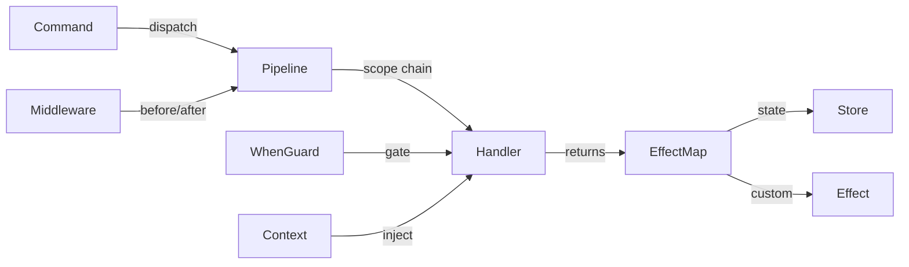

# 핵심 개념

> 커널 애플리케이션을 구성하는 7가지 요소

---

## 개요

Kernel은 7가지 핵심 개념으로 구성된다. 그 외의 모든 기능은 이들의 조합이다.



| 개념 | 역할 | 생성 방법 |
|---|---|---|
| Command | 의도를 서술하는 데이터 | `defineCommand()` → `CommandFactory()` |
| Effect | 부수 효과 핸들러 | `defineEffect()` |
| Context | 읽기 전용 데이터 주입 | `defineContext()` + `group({ inject })` |
| Scope | 커맨드 해석의 네임스페이스 | `defineScope()` + `group({ scope })` |
| When Guard | 조건부 커맨드 실행 게이트 | `defineCommand(..., { when })` |
| Middleware | 횡단 관심사 before/after 훅 | `group.use()` |
| State | 단일 불변 상태 트리 | `createKernel(initialState)` |

---

## Command

Command는 수행할 의도를 기술하는 불변 데이터 객체다. `defineCommand()`가 반환하는 CommandFactory 함수를 통해 생성한다.

### 정의

```typescript
// 페이로드 없음
const INCREMENT = kernel.defineCommand(
  "INCREMENT",
  (ctx) => () => ({
    state: { ...ctx.state, count: ctx.state.count + 1 },
  }),
);

// 페이로드 있음
const SET_COUNT = kernel.defineCommand(
  "SET_COUNT",
  (ctx) => (value: number) => ({
    state: { ...ctx.state, count: value },
  }),
);
```

### 핸들러 시그니처

핸들러는 컨텍스트 우선 커링(context-first curried) 패턴을 따른다.

```typescript
(ctx: { state: S, ...injected }) => (payload: P) => EffectMap | undefined
```

- `ctx.state` — 현재 상태 (읽기 전용)
- `ctx.{injected}` — `group({ inject })`를 통해 주입된 값
- EffectMap 반환 → 상태 변경과 이펙트를 선언한다
- `undefined` 반환 → 현재 스코프를 건너뛰고 부모로 버블링한다

커링을 채택한 이유는 핸들러의 두 관심사를 분리하기 위해서다. `ctx`(환경)는 커널이 주입하고, `payload`(데이터)는 호출자가 전달한다. 이 구조 덕분에 타입 추론이 ctx → payload 순으로 자연스럽게 흐른다.

### 디스패치

```typescript
kernel.dispatch(INCREMENT());       // void 페이로드
kernel.dispatch(SET_COUNT(42));     // number 페이로드

SET_COUNT("wrong");                 // ❌ 컴파일 오류
```

> [!IMPORTANT]
> `dispatch("INCREMENT")`나 `dispatch("SET_COUNT", 42)` 같은 형태는 지원하지 않는다.
> CommandFactory가 Command를 생성하고, dispatch는 이를 수신할 뿐이다. 단일 시그니처이며, 오버로드는 없다.
>
> `dispatch(TOKEN, payload)` 형태를 제거한 이유는 LLM 환각(hallucination) 방지에 있다. AI 모델이 오버로드 기반의 잘못된 호출 형태를 생성하는 빈도가 높으며, 단일 시그니처는 이 오류 클래스 전체를 차단한다.

### 버블링

핸들러가 `undefined` 또는 `null`을 반환하면, 커맨드는 부모 스코프로 버블링된다.

```typescript
const ACTION = scopedGroup.defineCommand(
  "ACTION",
  (ctx) => () => {
    if (!ctx.state.isReady) return undefined; // 버블링
    return { state: nextState };              // 처리 완료
  },
);
```

---

## Effect

이펙트는 부수 효과 핸들러다. 핸들러가 부수 효과를 직접 실행하는 대신, 반환값에 이펙트를 선언하면 엔진이 이를 실행한다.

이펙트를 데이터로 다루면 핸들러가 순수 함수로 유지되어 테스트가 용이해진다. 또한 트랜잭션 로그에 선언된 이펙트가 기록되므로 디버깅에도 유리하다. re-frame과 Elm의 핵심 통찰에 기반한 설계다.

### 정의

```typescript
const FOCUS_ID = kernel.defineEffect("FOCUS_ID", (id: string) => {
  document.getElementById(id)?.focus();
});

const SCROLL_TO = kernel.defineEffect("SCROLL_TO", (id: string) => {
  document.getElementById(id)?.scrollIntoView({ block: "nearest" });
});
```

### 핸들러에서의 사용

EffectToken을 반환 객체의 computed key로 사용한다.

```typescript
const NAVIGATE = kernel.defineCommand(
  "NAVIGATE",
  (ctx) => (direction: "up" | "down") => {
    const targetId = resolveTarget(ctx.state, direction);
    return {
      state: { ...ctx.state, focusedId: targetId },
      [FOCUS_ID]: targetId,     // ✅ string — 타입 검사 통과
      [SCROLL_TO]: targetId,    // ✅ string — 타입 검사 통과
    };
  },
);
```

### 내장 이펙트 키

| 키 | 동작 |
|---|---|
| `state` | 상태 트리를 교체한다 (최우선 실행) |
| `dispatch` | 커맨드를 재디스패치한다 (단일 또는 배열, 큐잉 처리) |

```typescript
return {
  state: nextState,
  dispatch: [CMD_A(), CMD_B()],  // 현재 커맨드 처리 후 큐에 추가
};
```

### 이펙트 스코핑

스코프 그룹에서 정의된 이펙트는 글로벌 이펙트를 오버라이드할 수 있다. 해석은 스코프 체인을 따른다.

```typescript
// GLOBAL: 기본 토스트
kernel.defineEffect("TOAST", (msg: string) => systemToast(msg));

// 위젯 스코프: 오버라이드
const widgetGroup = kernel.group({ scope: WIDGET });
widgetGroup.defineEffect("TOAST", (msg: string) => miniPopup(msg));
// → 위젯 커맨드는 miniPopup을 사용하고, 그 외에는 systemToast를 사용한다
```

> [!NOTE]
> 각 이펙트 핸들러는 try-catch로 감싸져 있다. 하나의 이펙트 실패가 다른 이펙트의 실행을 차단하지 않는다.

---

## Context

Context는 커맨드 핸들러에 읽기 전용 외부 데이터를 제공한다. re-frame의 coeffects에 대응하는 개념이다.

핸들러가 DOM 상태, 현재 시각 등 `kernel.getState()` 밖의 정보에 접근해야 할 때 Context를 사용한다. Context는 외부 데이터를 선언적으로 주입함으로써, 핸들러의 외부 의존성을 명시적으로 드러낸다.

### 정의

```typescript
const NOW = kernel.defineContext("NOW", () => Date.now());
const USER = kernel.defineContext("USER", () => ({
  name: "Alice",
  role: "admin",
}));
```

프로바이더 함수는 디스패치 시점에 호출된다. 캐싱 없이 항상 최신 값을 반환한다.

### 그룹 주입

`inject`를 통해 그룹이 필요로 하는 컨텍스트를 선언한다.

```typescript
const group = kernel.group({
  scope: MY_SCOPE,
  inject: [NOW, USER],
});

const CMD = group.defineCommand("CMD", (ctx) => () => {
  ctx.NOW;         // number — 자동 추론 ✅
  ctx.USER.name;   // string — 자동 추론 ✅
  ctx.state;       // AppState — 항상 존재 ✅
  return { state: ctx.state };
});
```

### 커맨드별 주입 (3인자 형태)

개별 커맨드에 추가 컨텍스트를 주입할 수 있다.

```typescript
const DOM_ITEMS = kernel.defineContext("DOM_ITEMS", () => queryDOMItems());

const NAVIGATE = kernel.defineCommand(
  "NAVIGATE",
  [DOM_ITEMS],  // 커맨드별 주입
  (ctx) => (direction: "up" | "down") => {
    const items = ctx.DOM_ITEMS; // ✅ 접근 가능
    // ...
  },
);
```

그룹 레벨 토큰과 커맨드별 토큰은 병합된다.

### 지연 평가

프로바이더는 해당 토큰을 inject하는 그룹의 커맨드에서만 호출된다. inject하지 않은 커맨드에서는 프로바이더가 호출되지 않는다.

```typescript
let calls = 0;
const EXPENSIVE = kernel.defineContext("EXPENSIVE", () => {
  calls++;
  return heavyComputation();
});

// inject하지 않는 그룹 — EXPENSIVE 프로바이더는 호출되지 않는다
kernel.defineCommand("CHEAP", (ctx) => () => ({ state: ctx.state }));
kernel.dispatch(CHEAP());
// calls === 0
```

모든 컨텍스트를 매 디스패치마다 해석하면 불필요한 DOM 접근이나 연산이 발생한다. inject를 선언한 커맨드만 해당 프로바이더를 호출하도록 하여, 필요한 만큼만 실행한다.

---

## Scope

스코프는 커맨드 해석을 위한 계층적 네임스페이스를 구성한다. DOM 이벤트 버블링과 유사한 메커니즘이다.

### 정의

```typescript
import { defineScope } from "@kernel";

const APP = defineScope("APP");
const SIDEBAR = defineScope("SIDEBAR");
const TODO_LIST = defineScope("TODO_LIST");
```

### 스코프 그룹 생성

```typescript
const kernel = createKernel(state);                  // GLOBAL
const app = kernel.group({ scope: APP });             // 부모: GLOBAL
const sidebar = app.group({ scope: SIDEBAR });        // 부모: APP
const todo = sidebar.group({ scope: TODO_LIST });     // 부모: SIDEBAR
```

이 중첩이 스코프 트리를 선언한다.

```
GLOBAL
└── APP
    └── SIDEBAR
        └── TODO_LIST
```

### 자동 버블링

스코프 그룹에서 디스패치된 커맨드는 버블 경로가 자동으로 확장된다.

```typescript
const TOGGLE = todo.defineCommand("TOGGLE", handler);

kernel.dispatch(TOGGLE("abc"));
// 자동 생성 경로: [TODO_LIST, SIDEBAR, APP, GLOBAL]
// TODO_LIST → SIDEBAR → APP → GLOBAL 순으로 핸들러를 탐색한다
```

| 경우 | 입력 | 동작 |
|---|---|---|
| 스코프 없음 | `dispatch(INCREMENT())` | `[GLOBAL]` 폴백 |
| 단일 스코프 (트리 내) | `dispatch(TOGGLE())` | 전체 경로로 자동 확장 |
| 단일 스코프 (고아) | `dispatch(ORPHAN_CMD())` | `[ORPHAN, GLOBAL]` |
| 복수 스코프 (수동) | `dispatch(cmd, { scope: [...] })` | 지정된 경로를 그대로 사용 |

자동 버블링을 도입한 이유는 매번 전체 스코프 경로를 수동으로 전달하면 코드가 장황해지고 오류가 발생하기 쉽기 때문이다. `group()` 중첩에서 부모-자식 관계가 이미 선언되어 있으므로, 커널이 이를 자동으로 확장한다.

### 상태 렌즈 상속

자식 스코프에 `stateSlice`를 별도로 지정하지 않으면, 부모의 상태 렌즈를 자동 상속한다.

```typescript
const appGroup = kernel.group({
  scope: APP_SCOPE,
  stateSlice: { get, set },
});

const childGroup = appGroup.group({ scope: CHILD_SCOPE });
// CHILD_SCOPE는 APP_SCOPE의 stateSlice를 상속한다
// 자식 핸들러도 동일한 상태 슬라이스를 참조한다
```

---

## When Guard

When Guard는 커맨드 실행의 선행 조건(precondition)을 선언한다. guard 함수가 `false`를 반환하면 해당 스코프를 건너뛰고 상위로 버블링한다.

### 정의

```typescript
const NAVIGATE = scopedGroup.defineCommand(
  "OS.NAVIGATE",
  (ctx) => (direction: "up" | "down") => ({
    state: { ...ctx.state, cursor: resolveCursor(ctx.state, direction) },
  }),
  { when: (state) => state.items.length > 0 },  // 아이템이 존재할 때만 실행
);
```

### 동작 순서

1. 핸들러 탐색 후, when guard가 등록되어 있으면 핸들러 실행 전에 guard를 평가한다
2. guard에는 상태 렌즈가 적용된다 — guard는 스코프된 상태를 참조한다
3. guard가 `false`를 반환하면 해당 스코프를 건너뛰고 상위로 버블링한다
4. guard가 `true`를 반환하면 핸들러를 실행한다

when guard를 도입한 이유는 기능적으로는 핸들러 내부의 `if (!condition) return undefined;`와 동일하지만, guard를 외부화하면 Inspector가 런타임에 guard 상태를 시각화할 수 있기 때문이다. `inspector.evaluateWhenGuard(scope, type)` API를 통해 특정 커맨드의 guard 활성 여부를 조회할 수 있다.

---

## Middleware

미들웨어는 커맨드 처리 전후에 실행되는 횡단 관심사 로직을 추가한다.

### 등록

```typescript
kernel.use({
  id: "LOGGER",
  before: (ctx) => {
    console.group(`[kernel] ${ctx.command.type}`);
    return ctx;
  },
  after: (ctx) => {
    console.groupEnd();
    return ctx;
  },
});
```

### 실행 순서 (양파 모델)

```
A:before → B:before → [handler] → B:after → A:after
```

### 기능

| 단계 | 가능한 작업 |
|---|---|
| `before` | 커맨드 타입 변환, `ctx.injected`에 데이터 주입 |
| `after` | 이펙트 변환, 이펙트 항목 추가 및 제거 |
| `fallback` | 리스너가 매칭하지 못한 네이티브 Event 처리 |

### 중복 제거

동일한 `id`를 가진 미들웨어는 동일 스코프 내에서 교체된다.

```typescript
kernel.use({ id: "logger", before: v1 }); // 등록
kernel.use({ id: "logger", before: v2 }); // v1이 v2로 교체됨
```

id 기반 중복 제거를 통해 HMR 환경에서 모듈이 재실행되어 `kernel.use()`가 다시 호출되더라도 미들웨어가 중복 등록되지 않는다.

---

## State

Kernel은 단일 불변 상태 트리를 관리한다. 모든 업데이트는 디스패치 파이프라인을 통해 이루어진다.

### 읽기

```typescript
// React 외부
kernel.getState();

// React 내부
const count = kernel.useComputed((s) => s.count);
```

### 업데이트

상태는 커맨드 핸들러를 통해서만 업데이트한다.

```typescript
const INCREMENT = kernel.defineCommand(
  "INCREMENT",
  (ctx) => () => ({
    state: { ...ctx.state, count: ctx.state.count + 1 },
  }),
);
```

### 직접 접근 (탈출구)

초기화, 테스트, 마이그레이션을 위한 탈출구로 제공된다.

```typescript
kernel.setState((prev) => ({ ...prev, count: 0 }));
kernel.reset({ count: 0 }); // 트랜잭션 로그도 함께 초기화
```

---

## 다음

→ [API 레퍼런스](./03-api-reference.md) — 시그니처와 타입을 포함한 전체 API 문서
