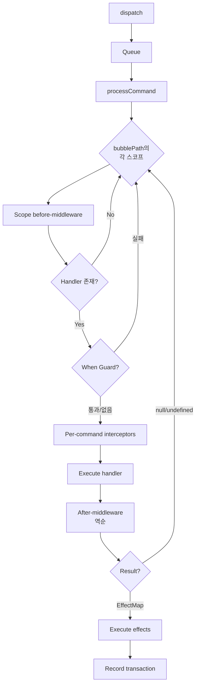

# 디스패치 파이프라인

> 커맨드가 `dispatch()`에서 상태 업데이트에 이르는 전 과정

---

## 파이프라인 개요



---

## 단계별 설명

### 1. 인큐

```typescript
kernel.dispatch(INCREMENT());
```

커맨드는 내부 큐에 추가된다. 디스패치가 이미 처리 중이면(재진입) 커맨드는 대기 상태가 된다. 이를 통해 디스패치 처리가 재진입 안전(re-entrance safe)하게 유지된다.

큐를 사용하는 이유는 핸들러나 이펙트가 `dispatch`를 재호출할 수 있기 때문이다. 즉시 처리를 허용하면 스택 오버플로우나 예측 불가능한 상태 순서가 발생할 수 있다. 큐 방식은 "현재 커맨드 처리 완료 후 다음 커맨드 처리"를 보장한다.

### 2. 스코프 체인 해석

엔진이 버블 경로(bubble path), 즉 탐색할 스코프의 순서 목록을 결정한다.

| 경우 | 동작 |
|---|---|
| `cmd.scope` 없음 | 경로 = `[GLOBAL]` |
| `cmd.scope = [A]`, A가 스코프 트리에 존재 | 자동 확장: `[A, parent, ..., GLOBAL]` |
| `cmd.scope = [A, B, C]` (복수) | 지정된 경로를 그대로 사용 (수동 오버라이드) |

```typescript
// 자동 확장 예시
// 스코프 트리: GLOBAL → APP → SIDEBAR → TODO_LIST
const TOGGLE = todoGroup.defineCommand("TOGGLE", handler);
kernel.dispatch(TOGGLE("abc"));
// bubblePath = [TODO_LIST, SIDEBAR, APP, GLOBAL]
```

### 3. 스코프 순회

버블 경로의 각 스코프에 대해 다음 과정을 수행한다.

#### 3a. Before 미들웨어

해당 스코프에 등록된 모든 미들웨어의 `before` 훅이 등록 순서대로 실행된다.

```typescript
// 미들웨어에 전달되는 컨텍스트
{
  command: cmd,        // 변환 가능
  state: currentState, // 읽기 전용 스냅샷
  handlerScope: currentScope,
  effects: null,
  injected: {},        // inject 인터셉터가 채운다
}
```

#### 3b. 핸들러 탐색

```typescript
const handler = scopedCommands[currentScope][mwCtx.command.type];
if (!handler) continue; // 다음 스코프로 진행
```

#### 3c. When Guard 평가

핸들러가 발견된 후, 해당 스코프와 타입에 when guard가 등록되어 있으면 이를 실행한다.

```typescript
const whenGuard = scopedWhenGuards[currentScope][resolvedType];
if (whenGuard) {
  const guardState = lens ? lens.get(state) : state;  // 렌즈 적용
  if (!whenGuard(guardState)) continue;  // guard 실패 → 버블링
}
```

핸들러 탐색과 guard 평가를 분리한 이유는 "핸들러가 존재하나 조건이 충족되지 않음"과 "핸들러 자체가 없음"을 구분하기 위해서다. Inspector가 이 차이를 시각화할 수 있다.

#### 3d. Per-command 인터셉터

커맨드가 속한 그룹에 `inject` 토큰이 있으면, 자동 생성된 인터셉터가 `ctx.injected`를 채운다.

```typescript
// group({ inject: [DOM_ITEMS, USER] })에 의해 자동 생성
const injected = {
  DOM_ITEMS: resolveContext("DOM_ITEMS"),
  USER: resolveContext("USER"),
};
```

#### 3e. 핸들러 실행

```typescript
const ctx = { state: scopedState, ...injectedMap, inject: ... };
const result = handler(ctx)(command.payload);
```

해당 스코프에 상태 렌즈가 등록되어 있으면 `ctx.state`에는 전체 트리가 아닌 스코프된 슬라이스만 포함된다.

#### 3f. After 미들웨어 (역순)

```
A:before → B:before → [handler] → B:after → A:after
```

after 미들웨어는 컨텍스트의 `effects` 필드를 변환할 수 있다.

#### 3g. 버블링 또는 중단

| 핸들러 반환값 | 동작 |
|---|---|
| `{ state, ... }` (EffectMap) | 중단 — 해당 스코프에서 처리 완료 |
| `null` 또는 `undefined` | 계속 — 다음 스코프로 버블링 |

### 4. 이펙트 실행

최종 EffectMap에서 이펙트를 처리한다.

```typescript
for (const [key, value] of Object.entries(effectMap)) {
  if (key === "state")    → setState(value)         // 최우선
  if (key === "dispatch") → queue commands           // 재진입 안전
  else                    → resolve effect handler   // 스코프 체인
}
```

이펙트 해석은 스코프 체인을 따른다.

```
핸들러 스코프 → 부모 스코프 → ... → GLOBAL
```

각 이펙트 핸들러는 try-catch로 감싸져 있어, 하나의 실패가 다른 이펙트의 실행을 차단하지 않는다.

`state` 이펙트 실행 시 핸들러 스코프에 렌즈가 설정되어 있으면 `lens.set(fullState, sliceValue)`를 통해 전체 상태에 다시 병합한다. 렌즈가 없으면 반환된 값이 전체 상태를 교체한다.

### 5. 트랜잭션 기록

모든 디스패치는 처리 여부와 무관하게 트랜잭션을 기록한다.

```typescript
{
  id: number,
  timestamp: number,
  command: { type, payload },
  handlerScope: string,       // 실제로 처리한 스코프
  bubblePath: string[],       // 순회한 전체 경로
  effects: EffectMap | null,
  changes: StateDiff[],       // 계산된 상태 차분
  stateBefore: unknown,
  stateAfter: unknown,
  meta?: Record<string, unknown>,
}
```

---

## 재진입 안전성

디스패치는 큐 기반으로 동작한다. 핸들러나 이펙트가 추가 디스패치를 트리거하면, 해당 커맨드는 큐에 추가되고 현재 커맨드가 완료된 후 처리된다.

```typescript
const A = kernel.defineCommand("A", (ctx) => () => ({
  state: ctx.state,
  dispatch: B(),  // 큐에 추가, 즉시 실행되지 않음
}));

const B = kernel.defineCommand("B", (ctx) => () => ({
  state: { ...ctx.state, b: true },
}));

kernel.dispatch(A());
// 처리 순서: A → (A 완료) → B
```

---

## 폴백 해석

OS 레이어 리스너(keyboard, mouse, clipboard)가 매칭되는 커맨드를 찾지 못하면 `resolveFallback(event)`를 통해 커널 미들웨어에 위임할 수 있다.

```typescript
const handled = kernel.resolveFallback(nativeEvent);
// GLOBAL 미들웨어의 fallback 훅을 순회한다
// 미들웨어가 Command를 반환하면 디스패치한다
```

이는 일반 디스패치와 별도의 사이드 채널이다. 일반 디스패치는 이미 구성된 Command를 처리하고, 폴백은 네이티브 Event로부터 Command를 생성하는 과정이다. 두 관심사를 분리하여 리스너와 미들웨어 각각의 역할을 명확히 한다.

---

## 다음

→ [타입 시스템](./05-type-system.md) — 토큰 타입과 컴파일 타임 안전성
