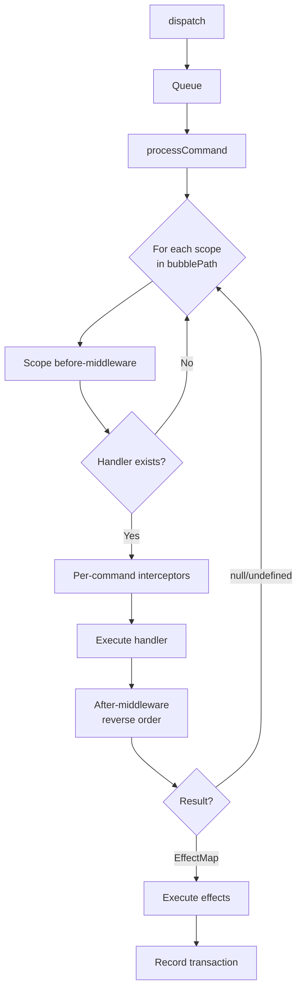

# Dispatch Pipeline

> How commands flow from `dispatch()` to state update.

---

## Pipeline Overview



---

## Step by Step

### 1. Enqueue

```typescript
kernel.dispatch(INCREMENT());
```

The command is pushed to an internal queue. If dispatch is already processing (re-entrance), the command waits. This makes dispatch **re-entrance safe**.

### 2. Scope Chain Resolution

The engine determines the **bubble path** — an ordered list of scopes to search:

| Case | Behavior |
|---|---|
| `cmd.scope` is absent | Path = `[GLOBAL]` |
| `cmd.scope = [A]` and A is in scope tree | Auto-expands: `[A, parent, ..., GLOBAL]` |
| `cmd.scope = [A, B, C]` (multi) | Used as-is (manual override) |

```typescript
// Auto expansion example
// Scope tree: GLOBAL → APP → SIDEBAR → TODO_LIST
const TOGGLE = todoGroup.defineCommand("TOGGLE", handler);
kernel.dispatch(TOGGLE("abc"));
// → bubblePath = [TODO_LIST, SIDEBAR, APP, GLOBAL]
```

### 3. Scope Iteration

For each scope in the bubble path:

#### 3a. Before-Middleware

All middleware registered at this scope run their `before` hooks in registration order:

```typescript
// ctx before middleware
{
  command: cmd,        // can be transformed
  state: currentState, // read-only snapshot
  handlerScope: currentScope,
  effects: null,
  injected: {},        // populated by inject interceptors
}
```

#### 3b. Handler Lookup

```typescript
const handler = scopedCommands[currentScope][mwCtx.command.type];
if (!handler) continue; // skip to next scope
```

#### 3c. Per-Command Interceptors

If the command's group has `inject` tokens, an auto-generated interceptor populates `ctx.injected`:

```typescript
// Auto-generated by group({ inject: [DOM_ITEMS, USER] })
const injected = {
  DOM_ITEMS: resolveContext("DOM_ITEMS"),
  USER: resolveContext("USER"),
};
```

#### 3d. Execute Handler

```typescript
const ctx = { state: scopedState, ...injectedMap, inject: ... };
const result = handler(ctx)(command.payload);
```

If a **state lens** is registered for this scope, `ctx.state` contains only the scoped slice (not the full tree).

#### 3e. After-Middleware (Reverse Order)

```
A:before → B:before → [handler] → B:after → A:after
```

After-middleware can transform the `effects` field of the context.

#### 3f. Bubble or Stop

| Handler Returns | Behavior |
|---|---|
| `{ state, ... }` (EffectMap) | **Stop** — handled at this scope |
| `null` or `undefined` | **Continue** — bubble to next scope |

### 4. Execute Effects

Effects are processed from the final `EffectMap`:

```typescript
for (const [key, value] of Object.entries(effectMap)) {
  if (key === "state")    → setState(value)         // always first
  if (key === "dispatch") → queue commands           // re-entrance safe
  else                    → resolve effect handler   // scope chain
}
```

**Effect resolution** follows the scope chain:

```
handler scope → parent scope → ... → GLOBAL
```

Each effect handler is wrapped in `try-catch` — one failure doesn't block others.

### 5. Record Transaction

Every dispatch (whether handled or not) records a transaction:

```typescript
{
  id: number,
  timestamp: number,
  command: { type, payload },
  handlerScope: string,       // which scope actually handled it
  bubblePath: string[],       // full path traversed
  effects: EffectMap | null,
  changes: StateDiff[],       // computed diff
  stateBefore: unknown,
  stateAfter: unknown,
  meta?: Record<string, unknown>,
}
```

---

## Re-Entrance Safety

Dispatch uses a **queue**. If a handler or effect triggers another dispatch, the new command is queued and processed after the current one completes.

```typescript
const A = kernel.defineCommand("A", (ctx) => () => ({
  state: ctx.state,
  dispatch: B(),  // queued, not immediate
}));

const B = kernel.defineCommand("B", (ctx) => () => ({
  state: { ...ctx.state, b: true },
}));

kernel.dispatch(A());
// Processing order: A → (A completes) → B
```

---

## Fallback Resolution

When an OS-layer listener (keyboard, mouse, clipboard) fails to find a matching command, it can delegate to kernel middleware via `resolveFallback(event)`:

```typescript
const handled = kernel.resolveFallback(nativeEvent);
// Iterates GLOBAL middleware `fallback` hooks
// If a middleware returns a Command, dispatches it
```

This is a **side channel** separate from normal dispatch — it handles the "listener miss" case.

---

## Next

→ [Type System](./05-type-system.md) — Token types and compile-time safety.
