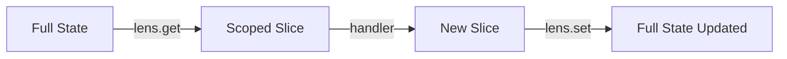

# State Management

> Single state tree, closure-based store, and state lens for scope isolation.

---

## Single State Tree

Kernel maintains a single immutable state tree. Every update produces a new state object.

```typescript
const kernel = createKernel<AppState>({
  os: { focus: { activeZoneId: null, focusedItemId: null } },
  apps: {},
});
```

---

## Reading State

### Outside React

```typescript
const current = kernel.getState();
console.log(current.os.focus.activeZoneId);
```

### Inside React

Use `useComputed` for reactive subscriptions:

```typescript
function FocusIndicator() {
  const focusedId = kernel.useComputed(
    (s) => s.os.focus.focusedItemId,
  );
  return <span>Focused: {focusedId}</span>;
}
```

`useComputed` uses `useSyncExternalStore` internally. It re-renders only when the selected value changes (by reference equality).

---

## Updating State

### Through Commands (Standard)

Commands are the standard way to update state:

```typescript
const INCREMENT = kernel.defineCommand(
  "INCREMENT",
  (ctx) => () => ({
    state: { ...ctx.state, count: ctx.state.count + 1 },
  }),
);

kernel.dispatch(INCREMENT());
```

The `state` key in the return object triggers `setState`:

```
handler returns { state: newState }
  → kernel calls setState(() => newState)
  → all subscribers notified
```

### Direct setState (Escape Hatch)

For initialization, testing, or migration:

```typescript
kernel.setState((prev) => ({
  ...prev,
  apps: { ...prev.apps, todo: initialTodoState },
}));
```

> [!WARNING]
> `setState` bypasses the dispatch pipeline entirely. No middleware, no effects, no transaction recorded. Use sparingly.

### Reset

Replaces state and clears the transaction log:

```typescript
kernel.reset({
  os: initialOSState,
  apps: {},
});
// Transaction log cleared. Registry preserved.
```

---

## Subscriptions

Subscribe to any state change:

```typescript
const unsubscribe = kernel.subscribe(() => {
  console.log("State changed:", kernel.getState());
});

// Later
unsubscribe();
```

All listeners fire synchronously after every `setState` call.

---

## State Lens

State Lens enables **scope isolation** — handlers in a scoped group see only their slice of the state tree, not the full tree.

### Problem

Without lens, every handler sees the entire `AppState`:

```typescript
// Handler sees { os: {...}, apps: { todo: {...}, kanban: {...} } }
const TOGGLE = todoGroup.defineCommand("TOGGLE", (ctx) => (id) => ({
  state: {
    ...ctx.state,
    apps: {
      ...ctx.state.apps,
      todo: {
        ...ctx.state.apps.todo,
        todos: ctx.state.apps.todo.todos.map(...)
      }
    }
  }
}));
```

### Solution

With `stateSlice`, the handler sees only `TodoState`:

```typescript
const todoGroup = kernel.group({
  scope: TODO_SCOPE,
  stateSlice: {
    get: (full: AppState) => full.apps.todo as TodoState,
    set: (full: AppState, slice: unknown) => ({
      ...full,
      apps: { ...full.apps, todo: slice },
    }),
  },
});

// Handler sees only TodoState
const TOGGLE = todoGroup.defineCommand(
  "TOGGLE",
  (ctx) => (id: string) => ({
    state: {
      ...ctx.state,  // ctx.state = TodoState
      todos: ctx.state.todos.map((t) =>
        t.id === id ? { ...t, done: !t.done } : t,
      ),
    },
  }),
);
```

### How It Works



1. Before handler execution: `lens.get(fullState)` → scoped state
2. Handler works with scoped state → returns new slice
3. After handler: `lens.set(fullState, newSlice)` → merged back

### Guarantees

- **Isolation**: App handlers cannot accidentally mutate OS state
- **Reference Identity**: Unrelated slices preserve reference identity (e.g., `state.os` is the exact same object before and after a todo command)
- **Full Type Safety**: `ctx.state` is typed as the scoped slice type

### With Context Injection

State lens and context injection work together:

```typescript
const FocusInfo = kernel.defineContext("FOCUS_INFO", () => ({
  focusedItemId: kernel.getState().os.focus.focusedItemId,
}));

const todoGroup = kernel.group({
  scope: TODO_SCOPE,
  inject: [FocusInfo],
  stateSlice: { get, set },
});

const TOGGLE_FOCUSED = todoGroup.defineCommand(
  "TOGGLE_FOCUSED",
  (ctx) => () => {
    // ctx.state = TodoState (from lens)
    // ctx.inject(FocusInfo) = OS focus data (from context)
    const focusedId = ctx.inject(FocusInfo).focusedItemId;
    return {
      state: {
        ...ctx.state,
        todos: ctx.state.todos.map((t) =>
          t.id === focusedId ? { ...t, done: !t.done } : t,
        ),
      },
    };
  },
);
```

---

## Transaction Log

Every dispatch records a transaction with state snapshots:

```typescript
type Transaction = {
  id: number;
  timestamp: number;
  command: { type: string; payload: unknown };
  handlerScope: string;
  bubblePath: string[];
  effects: Record<string, unknown> | null;
  changes: StateDiff[];       // computed diff
  stateBefore: unknown;
  stateAfter: unknown;
  meta?: Record<string, unknown>;
};

type StateDiff = {
  path: string;     // e.g., "count", "user.name", "items[3]"
  from: unknown;
  to: unknown;
};
```

### Usage

```typescript
const txs = kernel.getTransactions();  // readonly Transaction[]
const last = kernel.getLastTransaction();

console.log(last?.command.type);       // "SET_COUNT"
console.log(last?.changes);           // [{ path: "count", from: 0, to: 42 }]
```

### Time Travel

Restore state to any recorded transaction:

```typescript
kernel.travelTo(txId);
// Sets state to transaction's stateAfter snapshot
```

### Limits

- Transaction log is capped at **200 entries** (FIFO)
- `clearTransactions()` resets the log and ID counter

### State Diff Algorithm

`computeChanges(before, after)` produces a list of `StateDiff`:

- Recursively walks objects comparing properties
- Handles arrays element-by-element
- Max depth of 10 (flat diff after that)
- Returns `[]` if `before === after` (reference equal)

---

## Next

→ [Patterns & Recipes](./08-patterns.md) — Best practices and common patterns.
