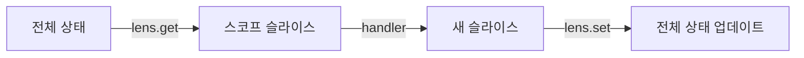

# 상태 관리

> 단일 상태 트리, 클로저 기반 스토어, 스코프 격리를 위한 상태 렌즈

---

## 단일 상태 트리

Kernel은 하나의 불변 상태 트리를 유지한다. 모든 업데이트는 새로운 상태 객체를 생성한다.

```typescript
const kernel = createKernel<AppState>({
  os: { focus: { activeZoneId: null, focusedItemId: null } },
  apps: {},
});
```

단일 트리를 채택한 이유는 시각화(Inspector), 직렬화(time travel), 디버깅(트랜잭션 로그)을 일관되게 지원하기 위해서다. 상태가 분산되어 있으면 이 세 가지 모두 복잡해진다.

---

## 상태 읽기

### React 외부

```typescript
const current = kernel.getState();
console.log(current.os.focus.activeZoneId);
```

### React 내부

`useComputed`를 통해 반응형 구독을 사용한다.

```typescript
function FocusIndicator() {
  const focusedId = kernel.useComputed(
    (s) => s.os.focus.focusedItemId,
  );
  return <span>Focused: {focusedId}</span>;
}
```

`useComputed`는 내부적으로 `useSyncExternalStore`를 사용한다. 선택된 값이 참조 동등성 기준으로 변경될 때만 리렌더링한다.

`useSyncExternalStore`를 채택한 이유는 React 18의 concurrent 기능과 호환되는 유일한 공식 외부 스토어 구독 API이기 때문이다. `useEffect` + `setState` 조합은 tearing 현상을 일으킬 수 있다.

---

## 상태 업데이트

### 커맨드를 통한 업데이트 (표준 경로)

커맨드 핸들러를 통한 업데이트가 표준적인 방법이다.

```typescript
const INCREMENT = kernel.defineCommand(
  "INCREMENT",
  (ctx) => () => ({
    state: { ...ctx.state, count: ctx.state.count + 1 },
  }),
);

kernel.dispatch(INCREMENT());
```

반환 객체의 `state` 키가 setState를 트리거한다.

```
핸들러가 { state: newState }를 반환
  → 커널이 setState(() => newState) 호출
  → 모든 구독자에게 통지
```

### 직접 setState (탈출구)

초기화, 테스트, 마이그레이션을 위한 탈출구로 제공된다.

```typescript
kernel.setState((prev) => ({
  ...prev,
  apps: { ...prev.apps, todo: initialTodoState },
}));
```

> [!WARNING]
> `setState`는 디스패치 파이프라인을 완전히 우회한다. 미들웨어, 이펙트, 트랜잭션 기록이 모두 생략된다. 필요한 경우에만 사용해야 한다.

### 리셋

상태를 교체하고 트랜잭션 로그를 초기화한다.

```typescript
kernel.reset({
  os: initialOSState,
  apps: {},
});
// 트랜잭션 로그가 초기화된다. 레지스트리는 유지된다.
```

---

## 구독

모든 상태 변경에 대해 리스너를 등록할 수 있다.

```typescript
const unsubscribe = kernel.subscribe(() => {
  console.log("State changed:", kernel.getState());
});

// 이후
unsubscribe();
```

모든 리스너는 `setState` 호출 후 동기적으로 실행된다.

---

## 상태 렌즈

상태 렌즈는 스코프 격리를 제공한다. 스코프 그룹의 핸들러가 전체 상태 트리가 아닌 자신의 슬라이스만 참조하게 된다.

### 렌즈 없이

렌즈가 없으면 모든 핸들러가 전체 AppState를 다루게 되어, 관련 없는 상태를 실수로 변경할 위험이 있다.

```typescript
// 핸들러가 { os: {...}, apps: { todo: {...}, kanban: {...} } } 전체를 본다
const TOGGLE = todoGroup.defineCommand("TOGGLE", (ctx) => (id) => ({
  state: {
    ...ctx.state,
    apps: {
      ...ctx.state.apps,
      todo: {
        ...ctx.state.apps.todo,
        todos: ctx.state.apps.todo.todos.map(...)
      }
    }
  }
}));
```

### 렌즈 적용

`stateSlice`를 설정하면 핸들러가 TodoState만 참조한다.

```typescript
const todoGroup = kernel.group({
  scope: TODO_SCOPE,
  stateSlice: {
    get: (full: AppState) => full.apps.todo as TodoState,
    set: (full: AppState, slice: unknown) => ({
      ...full,
      apps: { ...full.apps, todo: slice },
    }),
  },
});

// 핸들러는 TodoState만 참조한다
const TOGGLE = todoGroup.defineCommand(
  "TOGGLE",
  (ctx) => (id: string) => ({
    state: {
      ...ctx.state,  // ctx.state = TodoState
      todos: ctx.state.todos.map((t) =>
        t.id === id ? { ...t, done: !t.done } : t,
      ),
    },
  }),
);
```

### 동작 원리



1. 핸들러 실행 전: `lens.get(fullState)` → 스코프된 상태를 추출한다
2. 핸들러가 스코프된 상태를 기반으로 새 슬라이스를 반환한다
3. 핸들러 실행 후: `lens.set(fullState, newSlice)` → 전체 상태에 다시 병합한다

### 보장 사항

- **격리**: 앱 핸들러가 OS 상태를 실수로 변경할 수 없다
- **참조 동등성**: 관련 없는 슬라이스는 참조가 보존된다 (예: todo 커맨드 이후에도 `state.os`는 동일한 객체)
- **타입 안전성**: `ctx.state`가 스코프 슬라이스 타입으로 지정된다

### 렌즈 상속

자식 스코프에 `stateSlice`를 별도로 지정하지 않으면 부모의 렌즈를 자동 상속한다.

```typescript
const appGroup = kernel.group({
  scope: APP_SCOPE,
  stateSlice: { get, set },
});

// 자식 스코프 — stateSlice 미지정
const childGroup = appGroup.group({ scope: CHILD_SCOPE });
// CHILD_SCOPE는 APP_SCOPE의 stateSlice를 상속한다
// childGroup의 핸들러도 동일한 상태 슬라이스를 참조한다
```

같은 도메인 내의 하위 스코프들은 대부분 동일한 상태 슬라이스에서 작업한다. 매번 `stateSlice`를 반복 지정하면 중복이 발생하고 불일치 위험이 생긴다.

### 컨텍스트 주입과의 조합

상태 렌즈와 컨텍스트 주입은 함께 사용할 수 있다.

```typescript
const FocusInfo = kernel.defineContext("FOCUS_INFO", () => ({
  focusedItemId: kernel.getState().os.focus.focusedItemId,
}));

const todoGroup = kernel.group({
  scope: TODO_SCOPE,
  inject: [FocusInfo],
  stateSlice: { get, set },
});

const TOGGLE_FOCUSED = todoGroup.defineCommand(
  "TOGGLE_FOCUSED",
  (ctx) => () => {
    // ctx.state = TodoState (렌즈)
    // ctx.inject(FocusInfo) = OS 포커스 데이터 (컨텍스트)
    const focusedId = ctx.inject(FocusInfo).focusedItemId;
    return {
      state: {
        ...ctx.state,
        todos: ctx.state.todos.map((t) =>
          t.id === focusedId ? { ...t, done: !t.done } : t,
        ),
      },
    };
  },
);
```

렌즈는 소유한 상태를 좁히고, 컨텍스트는 소유하지 않은 외부 데이터를 주입한다. Todo 핸들러가 OS의 포커스 상태를 참조해야 할 때, 상태 트리 전체를 노출하는 대신 `inject`로 필요한 부분만 명시적으로 가져온다.

---

## 트랜잭션 로그

모든 디스패치는 상태 스냅샷을 포함한 트랜잭션을 기록한다.

```typescript
type Transaction = {
  id: number;
  timestamp: number;
  command: { type: string; payload: unknown };
  handlerScope: string;
  bubblePath: string[];
  effects: Record<string, unknown> | null;
  changes: StateDiff[];       // 계산된 상태 차분
  stateBefore: unknown;
  stateAfter: unknown;
  meta?: Record<string, unknown>;
};

type StateDiff = {
  path: string;     // 예: "count", "user.name", "items[3]"
  from: unknown;
  to: unknown;
};
```

### 사용법

```typescript
const txs = kernel.inspector.getTransactions();  // readonly Transaction[]
const last = kernel.inspector.getLastTransaction();

console.log(last?.command.type);       // "SET_COUNT"
console.log(last?.changes);           // [{ path: "count", from: 0, to: 42 }]
```

### 타임 트래블

기록된 트랜잭션의 상태로 복원할 수 있다.

```typescript
kernel.inspector.travelTo(txId);
// 해당 트랜잭션의 stateAfter 스냅샷으로 상태를 복원한다
```

### 제한 사항

- 트랜잭션 로그는 최대 200개 항목을 유지한다 (FIFO)
- `clearTransactions()`는 로그와 ID 카운터를 함께 초기화한다

### 상태 차분 알고리즘

`computeChanges(before, after)`는 StateDiff 목록을 생성한다.

- 객체의 프로퍼티를 재귀적으로 비교한다
- 배열은 요소별로 처리한다
- 최대 깊이 10을 넘으면 전체를 하나의 diff로 기록한다
- `before === after`(참조 동등)이면 빈 배열을 반환한다

---

## 다음

→ [패턴 & 레시피](./08-patterns.md) — 모범 사례와 일반적인 패턴
